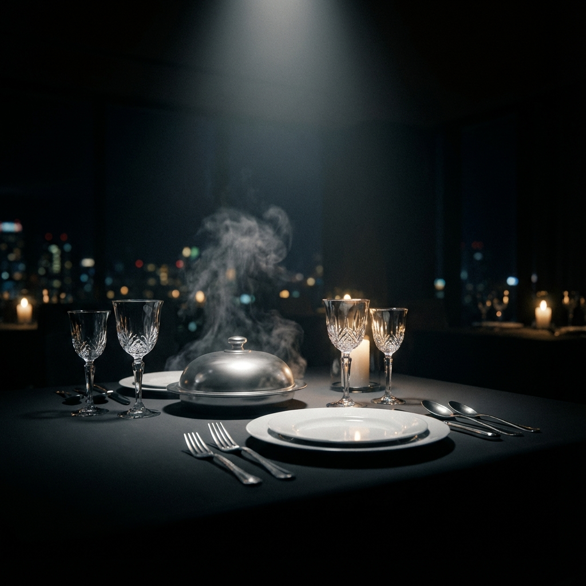

# Lumière - Radiant Dining Experience
### A Premium Landing Page & UI Design Showcase



## 🎨 Project Overview

**Lumière** is a high-fidelity concept landing page built to demonstrate advanced **UI Design** and **Frontend Architecture** skills. 

The primary goal of this project was to move beyond standard web layouts and create an immersive, "premium" digital experience. It focuses heavily on atmosphere, micro-interactions, and fluid motion to evoke the feeling of a high-end fine dining establishment.

This repository serves as a portfolio piece showcasing:
- **Atmospheric UI**: Usage of deep color palettes (`#0f291e`), subtle gradients, and glassmorphism to create depth.
- **Advanced Animations**: Complex scroll-triggered reveals and staggered entrance effects using **Framer Motion**.
- **Micro-Interactions**: Custom "shiny" button effects, reactive hover states, and smooth transitions that enhance user engagement.
- **Component Architecture**: Clean, reusable React components styled with the flexible **Tailwind CSS v4** engine.

## 🛠️ Technology Stack

- **Framework**: [React 18](https://react.dev/) + [Vite](https://vitejs.dev/)
- **Styling**: [Tailwind CSS v4](https://tailwindcss.com/) (using CSS variables and `@theme`)
- **Animations**: [Framer Motion](https://www.framer.com/motion/)
- **Icons**: Custom SVG implementation & Line Awesome
- **Assets**: AI-generated imagery for concept visualization

## ✨ Key Features

1.  **Hero Section**:
    *   Features a "Michelin Star" badge concept.
    *   Custom typography with gradient text effects.
    *   Staggered entrance animations on load.

2.  **Interactive Elements**:
    *   **"Shiny" Buttons**: A custom CSS/Tailwind implementation where a light sheen tracks across the button on hover/load.
    *   **Card Hover Effects**: Menu items and testimonials lift and glow subtly upon interaction.

3.  **Visual Polish**:
    *   **Custom Logo**: Integrated SVG branding.
    *   **Dynamic Navbar**: Transitions from transparent to blurred glass on scroll.
    *   **Responsive Layout**: Fully optimized mobile-first design grid.

## 🚀 Getting Started

To run this project locally:

1.  **Clone the repository**
    ```bash
    git clone https://github.com/yourusername/lumiere-landing.git
    ```

2.  **Install Dependencies**
    ```bash
    cd restaurent
    npm install
    ```

3.  **Start Development Server**
    ```bash
    npm run dev
    ```

4.  Open `http://localhost:5173` in your browser.

---

*Designed and Developed by Kushal Roy Chowdhury as a showcase of modern web design capabilities.*
